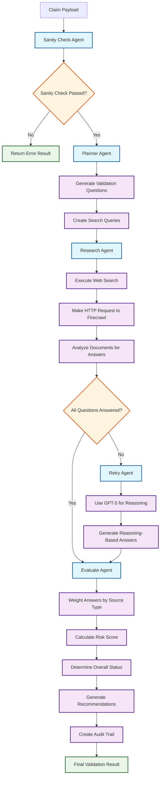
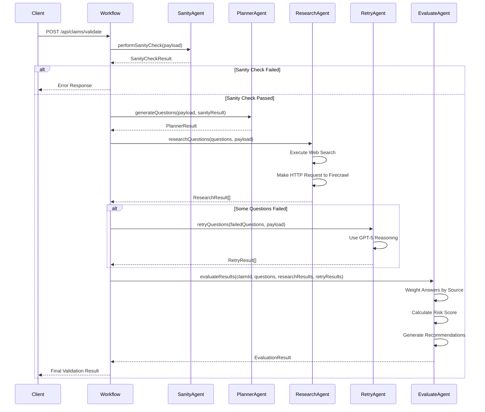
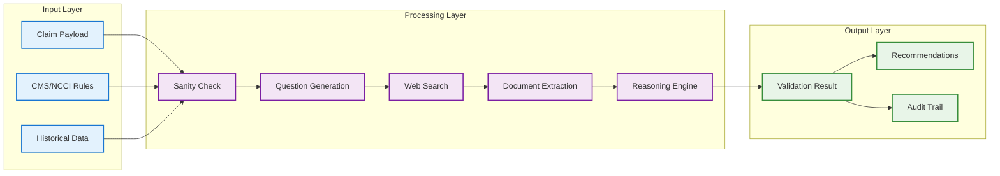

# Medical Claim Validation Workflow

## Overview

This document describes the complete multi-agent workflow for validating medical claims using AI agents, web search, and document extraction. The workflow ensures high accuracy by combining multiple sources of truth with proper weighting and fallback mechanisms.

## Claim Payload Structure

### Root Level
```json
{
  "callback_url": "string",
  "payload": {
    // Claim validation data
  }
}
```

### Complete Example
```json
{
  "callback_url": "https://4b1c6eb8-626e-4dc7-90ed-24ea6e6ed559.lovableproject.com/api/chat-updates/febfcbfe-e7e9-49f8-b783-51fc24bf9195",
  "payload": {
    "payer": "Molina Healthcare",
    "domains": ["molinahealthcare.com"],
    "seed_urls": ["https://www.molinahealthcare.com/policies"],
    "cpt_codes": ["99230","64636"],
    "icd10_codes": ["Z00.00"],
    "place_of_service": "11",
    "modifiers": [],
    "prior_treatments": [],
    "member_plan_type": "PPO",
    "state": "NM",
    "note_summary": "Lumbar facet radiofrequency ablation at L4–S1 following two diagnostic medial branch blocks with >80% temporary pain relief."
  }
}
```

### Field Descriptions

| Field | Type | Required | Description | Example |
|-------|------|----------|-------------|---------|
| `callback_url` | string | Yes | Webhook URL for receiving validation results | "https://example.com/callback" |
| `payload.payer` | string | Yes | Insurance payer name | "Molina Healthcare" |
| `payload.domains` | string[] | No | Payer-specific domains for policy searches | ["molinahealthcare.com"] |
| `payload.seed_urls` | string[] | No | Starting URLs for policy extraction | ["https://www.molinahealthcare.com/policies"] |
| `payload.cpt_codes` | string[] | Yes | Current Procedural Terminology codes | ["99230","64636"] |
| `payload.icd10_codes` | string[] | Yes | ICD-10 diagnosis codes | ["Z00.00"] |
| `payload.place_of_service` | string | No | Place of service code | "11" |
| `payload.modifiers` | string[] | No | CPT code modifiers | ["25", "59"] |
| `payload.prior_treatments` | string[] | No | Previous treatments or procedures | ["64483", "64484"] |
| `payload.member_plan_type` | string | No | Insurance plan type | "PPO" |
| `payload.state` | string | No | State abbreviation | "NM" |
| `payload.note_summary` | string | Yes | Clinical notes summary | "Lumbar facet radiofrequency ablation..." |

### Validation Rules

- **CPT Codes**: 5-digit numeric codes (e.g., "99230", "64636")
- **ICD-10 Codes**: Letter followed by digits, optional decimal (e.g., "Z00.00", "M54.5")
- **Place of Service**: 2-digit numeric code (e.g., "11" - Office, "21" - Inpatient)
- **Modifiers**: 2-character alphanumeric codes (e.g., "25", "59", "LT", "RT")
- **State**: 2-letter state abbreviation (e.g., "NM", "CA", "TX")

## Firecrawl Integration

### API Endpoint
```
POST http://localhost:3002/v2/scrape
Content-Type: application/json
Authorization: Bearer {FIRECRAWL_API_KEY}
```

### Structured JSON Extraction

Firecrawl supports structured JSON extraction with custom schemas and prompts for precise data extraction from policy documents.

#### Example Request
```bash
curl -X POST http://localhost:3002/v2/scrape \
  -H 'Content-Type: application/json' \
  -d '{
    "url": "https://www.molinahealthcare.com/~/media/Molina/PublicWebsite/PDF/providers/common/medicare/forms_IL_Medicaid_MMP_PACodification.pdf",
    "formats": [         
      {                      
        "type": "json",        
        "schema": {          
          "type": "object",
          "properties": {          
            "target_codes": {    
              "type": "object",                        
              "properties": {                            
                "64635": {                              
                  "type": "object",
                  "properties": {
                    "pa_required": {"type": "boolean"},
                    "procedure_name": {"type": "string"},
                    "found_in_list": {"type": "boolean"}
                  }                                    
                },                                       
                "64636": {                              
                  "type": "object",
                  "properties": {
                    "pa_required": {"type": "boolean"},
                    "procedure_name": {"type": "string"},
                    "found_in_list": {"type": "boolean"}
                  }
                }
              }
            }
          }
        },
        "prompt": "Extract information about CPT codes 64635 and 64636 from this Molina Healthcare Illinois Medicaid MMP policy document. Determine if these codes require prior authorization and provide the procedure names."
      }
    ]
  }'
```

#### Format Structure
```json
{
  "formats": [
    {
      "type": "json",
      "schema": {
        "type": "object",
        "properties": {
          "target_codes": {
            "type": "object",
            "properties": {
              "CPT_CODE": {
                "type": "object",
                "properties": {
                  "pa_required": {"type": "boolean"},
                  "procedure_name": {"type": "string"},
                  "found_in_list": {"type": "boolean"},
                  "coverage_notes": {"type": "string"},
                  "restrictions": {"type": "string"}
                }
              }
            }
          }
        }
      },
      "prompt": "Extraction prompt for structured data"
    }
  ]
}
```

#### Supported Format Types
- **json**: Structured extraction with custom schema
- **markdown**: Markdown formatted content
- **html**: Raw HTML content
- **text**: Plain text content

#### Schema Properties for CPT Codes
- **pa_required**: Boolean indicating if prior authorization is required
- **procedure_name**: String with the procedure name
- **found_in_list**: Boolean indicating if the code was found in the document
- **coverage_notes**: String with additional coverage information
- **restrictions**: String with any restrictions or requirements

### Integration with Research Agent

The Research Agent uses Firecrawl's structured extraction to:
1. **Extract CPT-specific information** from payer policy documents
2. **Determine prior authorization requirements** for specific codes
3. **Get procedure names and coverage details** from official sources
4. **Identify restrictions and requirements** for each code

#### Example Usage in Research Agent
```typescript
// Extract structured data for specific CPT codes
const result = await extractDocumentWithFirecrawl(
  "https://payer.com/policy.pdf",
  ["64635", "64636"],
  "Extract prior authorization requirements for these CPT codes"
);

// Result structure
{
  "success": true,
  "data": {
    "target_codes": {
      "64635": {
        "pa_required": true,
        "procedure_name": "Destruction of neurolytic agent",
        "found_in_list": true,
        "coverage_notes": "Requires prior authorization",
        "restrictions": "Maximum 2 per year"
      },
      "64636": {
        "pa_required": false,
        "procedure_name": "Destruction of neurolytic agent",
        "found_in_list": true,
        "coverage_notes": "Covered under standard benefits",
        "restrictions": "None"
      }
    }
  }
}
```

## Workflow Architecture

```
Claim Payload → Sanity Check Agent → Planner Agent → Research/Retry Agents → Evaluate Agent → Final Result
```

## Workflow Flow Chart



## Detailed Workflow Steps

### 1. Sanity Check Agent
**Purpose**: Initial validation of CPT/ICD codes and CMS/NCCI rules

**Input**: 
- Claim payload (CPT codes, ICD codes, notes, payer info)
- CMS/NCCI static rules database

**Process**:
- Validate CPT/ICD code formats and relationships
- Check against CMS/NCCI bundling rules
- Verify code compatibility and dependencies
- Perform basic specialty/subspecialty prediction (SSP)
- Flag obvious issues (invalid codes, bundling conflicts)

**Output**:
- Sanitized claim payload
- Initial SSP prediction
- Flagged issues and warnings
- Pass/fail status for basic validation

**Tools Used**:
- Static CMS/NCCI rules database
- OpenAI GPT-4o for code validation
- Basic pattern matching

### 2. Planner Agent
**Purpose**: Create targeted validation questions and web search queries

**Input**:
- Sanitized claim payload
- SSP prediction from sanity check
- Payer information

**Process**:
- Generate 2-3 questions per tier:
  - **Basic**: Payer/claim mechanics (PA, eligibility, POS/modifiers, NCCI edits, frequency, plan rules)
  - **Specialty**: Rules typical for the inferred specialty
  - **Subspecialty**: Fine-grained checks specific to the procedure/subspecialty
- Create web search queries for each question
- Prioritize questions by risk level

**Output**:
- Structured questions with search queries
- Risk flags for each question
- Priority ordering

**Tools Used**:
- OpenAI GPT-4o for question generation
- Specialty mapping database
- Risk assessment algorithms

### 3. Research Agent (Multi-Model Parallel Architecture)
**Purpose**: Answer questions using web search, document extraction, and parallel AI model consensus

**Input**:
- Questions from planner agent
- Search queries
- Claim context

**Process**:
- Execute web searches using custom Google search engine
- **Firecrawl Data Extraction**: Extract structured data from payer policy documents
- **Multi-Model Analysis**: Leverage pretrained medical knowledge for interpretation
  - **Claude Agent**: Complex policy analysis and nuanced interpretation
  - **GPT-5 Agent**: Clinical reasoning and medical coding expertise
  - **DeepSeek Agent**: Fast, cost-effective routine checks
- **Hybrid Validation**: Cross-reference extracted policy data with model expertise
- **Consensus Engine**: Cross-validate interpretations across models
- Provide confidence scores based on external data + model agreement
- Identify source documents and citations

**Output**:
- Answers to questions with confidence scores
- Source documents and citations
- Search metadata and timestamps
- Model consensus results

**Tools Used**:
- Custom Google Search API
- **Firecrawl API**: Structured data extraction from policy documents
- **Parallel AI Models**: Claude, GPT-5, DeepSeek (pretrained medical knowledge)
- **Hybrid Validation Engine**: Cross-reference external data with model expertise
- **Consensus Engine**: Cross-validation and scoring

### 4. Retry Agent (Fallback)
**Purpose**: Provide answers when web search fails or confidence is low

**Input**:
- Unanswered questions from research agent
- Claim context and previous attempts

**Process**:
- Use OpenAI GPT-5 for reasoning-based answers
- Apply domain knowledge and patterns
- Provide confidence scores (typically lower than web search)
- Flag as "reasoning-based" vs "document-based"

**Output**:
- Reasoning-based answers
- Confidence scores
- Reasoning chains

**Tools Used**:
- OpenAI GPT-5
- Domain knowledge base
- Pattern recognition

### 5. Evaluate Agent
**Purpose**: Create final validation payload with recommendations

**Input**:
- All questions and answers from research/retry agents
- Source documents and confidence scores
- Claim context and SSP prediction

**Process**:
- Weight answers based on source type:
  - **Firecrawl extracted documents**: High weight (0.9-1.0)
  - **Web search results**: Medium weight (0.6-0.8)
  - **GPT reasoning**: Low weight (0.3-0.5)
- Determine overall claim status (GO/NO_GO)
- Generate specific recommendations and fixes
- Create audit trail with sources

**Output**:
- Final validation result
- Detailed recommendations
- Source citations and confidence scores
- Audit trail

**Tools Used**:
- Weighting algorithms
- Decision trees
- Audit logging

## Answer Weighting System

### Source Types and Weights

1. **Firecrawl Extracted Documents** (Weight: 0.9-1.0)
   - Official payer policies
   - CMS/NCCI documentation
   - Medical coding guidelines
   - High confidence, authoritative sources

2. **Multi-Model Consensus** (Weight: 0.8-0.9)
   - **High Consensus**: 2+ models agree (Weight: 0.9)
   - **Medium Consensus**: 1 model with strong reasoning (Weight: 0.7)
   - **Low Consensus**: Conflicting results (Weight: 0.5)

3. **Web Search Results** (Weight: 0.6-0.8)
   - General medical information
   - Coding forums and discussions
   - Medium confidence, community sources

4. **Single Model Reasoning** (Weight: 0.3-0.5)
   - AI-generated answers based on training data
   - Pattern recognition and inference
   - Lower confidence, fallback option

### Model Specialization and Routing

- **Claude Agent**: Complex policy analysis, legal language interpretation
- **GPT-5 Agent**: Clinical reasoning, medical coding expertise
- **DeepSeek Agent**: Fast, cost-effective routine checks
- **Question Routing**: Route questions to appropriate models based on complexity and type

### Hybrid Research Strategy

**Firecrawl + Multi-Model Approach**:
- **Firecrawl**: Extract current, payer-specific policy data from official documents
- **Multi-Models**: Leverage pretrained medical knowledge for clinical interpretation
- **Cross-Reference**: Validate extracted policy data against model expertise
- **Consensus**: Combine external data with model reasoning for robust answers

**Example Research Flow**:
1. **Firecrawl**: "CPT 64636 requires prior authorization for Molina Healthcare"
2. **Claude**: "This aligns with CMS guidelines for neurolytic procedures"
3. **GPT-5**: "The documentation requirements include diagnostic blocks"
4. **DeepSeek**: "Cost-effective alternative: consider 64635 if criteria not met"
5. **Final Answer**: Combined external policy data + model expertise

### Confidence Scoring

- **High (0.8-1.0)**: Direct answer from authoritative source or multi-model consensus
- **Medium (0.5-0.7)**: Indirect answer, multiple supporting sources, or single model with strong reasoning
- **Low (0.2-0.4)**: Reasoning-based, conflicting sources, or low consensus

## Error Handling and Fallbacks

### 1. Web Search Failures
- Retry with modified queries
- Fall back to GPT reasoning
- Log search failures for analysis

### 2. Firecrawl Extraction Failures
- Retry with different extraction parameters
- Use web search results as fallback
- Flag as lower confidence

### 3. Multi-Model Consensus Failures
- **Model Unavailability**: Fall back to available models
- **Conflicting Results**: Use majority consensus or flag for manual review
- **Timeout Issues**: Implement circuit breakers for slow models
- **Cost Optimization**: Route to most cost-effective available model

### 4. Agent Failures
- Implement circuit breakers
- Fall back to simpler validation
- Log errors for monitoring

## Performance Metrics

### Target Performance
- **Processing Time**: 9-12 seconds per claim
- **Accuracy**: 95%+ for denial prediction
- **First-Pass Rate**: 90% against payer AI denials
- **Cost**: $0.58 per claim

### Monitoring
- Track agent success rates
- Monitor answer confidence distributions
- Log processing times per agent
- Track fallback usage patterns
- **Multi-Model Metrics**:
  - Model consensus rates
  - Individual model performance
  - Cost per model per question type
  - Consensus accuracy vs single model accuracy

## Implementation Notes

### Agent Communication
- Use structured JSON for inter-agent communication
- Implement retry mechanisms for failed communications
- Log all agent interactions for debugging

### Caching Strategy
- Cache web search results (24 hours)
- Cache Firecrawl extractions (7 days)
- Cache agent responses (1 hour)
- **Multi-Model Caching**:
  - Cache consensus results (2 hours)
  - Cache individual model responses (1 hour)
  - Cache model performance metrics (24 hours)
- Use Redis for high-performance caching

### Security and Compliance
- Tokenize PHI in all communications
- Encrypt sensitive data in transit
- Implement audit logging for HIPAA compliance
- Use secure API keys and authentication

## Future Enhancements

1. **Machine Learning Integration**
   - Train models on historical validation results
   - Improve answer weighting based on outcomes
   - Optimize search queries based on success rates
   - **Multi-Model Learning**: Optimize model selection based on question type and historical performance

2. **Real-Time Updates**
   - Stream policy updates to agents
   - Implement real-time learning from new denials
   - Update confidence models based on feedback
   - **Dynamic Model Routing**: Adjust model selection based on real-time performance

3. **Advanced Analytics**
   - Track denial patterns across payers
   - Identify emerging coding trends
   - Predict policy changes
   - **Consensus Analytics**: Analyze model agreement patterns and optimize consensus thresholds

4. **Multi-Model Architecture Enhancements**
   - **Model Specialization**: Fine-tune models for specific question types
   - **Consensus Optimization**: Implement weighted consensus based on model expertise
   - **Cost-Performance Optimization**: Balance accuracy vs cost for different question types
   - **Model Performance Tracking**: Real-time monitoring of individual model accuracy

## Agent Communication Flow



## Data Flow Diagram



## Missing Components from ClaimForge.md

### 1. **Static CMS/NCCI Validation**
**Purpose**: Validate payloads against CMS/NCCI rules for code/modifier alignment, bundling, dependencies

**Implementation**:
- Source CMS/NCCI 2025 datasets (cms.gov/cpt-2025.json)
- Include valid_icd, bundling, modifiers, prior_auth
- Prompt o1 for issues (e.g., { code: "99214", risk: "65%", reason: "Missing Mod 59" })
- Test with bundling risks (e.g., 64483+99214)

**Acceptance Criteria**:
- Validates 5 payloads
- Flags bundling issues
- Processes in ~2-3s

### 2. **Prior Authorization Prediction (PA-Predict)**
**Purpose**: Flag PA-required CPTs using o1 and CMS/NCCI rules

**Implementation**:
- Add prior_auth to cms_ncci_2025.json
- Prompt o1 for { code, risk, reason }
- Test with PA-required (64483) and non-PA (99213) CPTs

**Acceptance Criteria**:
- Flags PAs with 95% accuracy
- Outputs clear reasons
- Tests 3 PA-required, 3 non-PA payloads

### 3. **Dynamic Gold-Carding Engine (DGC)**
**Purpose**: Identify high-performing providers (95%+ approval) for PA exemptions

**Implementation**:
- Track approval rates in Redis (e.g., provider:PRV789:64483:Anthem:98%)
- Scrape gold-carding policies (e.g., https://anthem.com/gold-card)
- Prompt o1 for exemptions (e.g., "PRV789 skips PA for 64483")

**Acceptance Criteria**:
- Flags gold-carding for 2/3 providers
- Reduces PA checks by 20%
- Verifies policies via Firecrawl

### 4. **Payer AI Counterintelligence (PACI)**
**Purpose**: Analyze payer AI denial patterns to pre-adjust claims

**Implementation**:
- Scrape denial patterns via Firecrawl (e.g., "Anthem AI denies 99214 for missing E/M")
- Store patterns in Redis (e.g., denial_pattern:99214:Anthem:missing_em)
- Prompt o1 to adjust claims (e.g., add "VAS pain 8/10" to notes)

**Acceptance Criteria**:
- Adjusts 5 payloads to bypass payer AI
- Achieves 90% first-pass rate in tests
- Caches patterns, verified via redis-cli

## Agent Patterns from n8n Workflow

### 1. **Planner Agent Pattern**
**Key Features**:
- Generates 2-3 questions per tier (basic, specialty, subspecialty)
- Each question ≤160 chars, atomic, neutral
- Includes accept_if criteria and search_queries
- Risk flags for different categories

**Output Structure**:
```json
{
  "questions": [
    {
      "n": 1,
      "type": "basic|specialty|subspecialty",
      "q": "string <=160 chars, atomic, neutral",
      "accept_if": ["string", "string"],
      "search_queries": ["site:domain.tld ..."],
      "risk_flags": {
        "PA": false, "POS": false, "NCCI": false,
        "Modifiers": false, "Frequency": false,
        "Diagnosis": false, "StateSpecific": false,
        "LOBSpecific": false, "Thresholds": false
      }
    }
  ],
  "meta": {
    "specialty": "string",
    "subspecialty": "string",
    "rationale": "string",
    "derived": {
      "cpt_codes": ["string"],
      "icd10_codes": ["string"],
      "place_of_service": "string",
      "member_plan_type": "string",
      "state": "string"
    }
  }
}
```

### 2. **Research Agent Pattern**
**Key Features**:
- Model-only, balanced, decision-grade
- Provides concise, decision-oriented hypothesis
- Uses domain knowledge only (no tools)
- Confidence levels: low, medium, high

**Output Structure**:
```json
[
  {
    "n": "string",
    "type": "basic|specialty|subspecialty",
    "q": "string",
    "status": "ok|insufficient",
    "model_only": "true",
    "summary": "Likely yes—... / Likely no—... / Unclear—...",
    "likely_accept_if": "string",
    "confidence": "low|medium|high",
    "disclaimers": "Plan, state, and line-of-business rules vary; verify in official policy.",
    "next_checks": ["string", "string"]
  }
]
```

### 3. **Retry Agent Pattern**
**Key Features**:
- Model-only, decisive, decision-grade
- Reassesses questions using domain knowledge
- More decisive than first pass, but remains safe
- Uses previous_result as baseline

**Output Structure**:
```json
[
  {
    "n": "string",
    "type": "basic|specialty|subspecialty",
    "q": "string",
    "status": "ok|insufficient",
    "model_only": "true",
    "summary": "Likely yes—... / Likely no—... / Unclear—...",
    "likely_accept_if": "string",
    "confidence": "low|medium|high",
    "disclaimers": "Plan, state, and line-of-business rules vary; verify in official policy.",
    "next_checks": ["string", "string"]
  }
]
```

### 4. **Evaluate Agent Pattern**
**Key Features**:
- Model-only evaluator
- Treats all items as heuristic decisions
- BASIC questions are gatekeepers
- Requires at least one SPECIALTY or SUBSPECIALTY to pass

**Output Structure**:
```json
{
  "per_question": [
    {
      "n": "string",
      "type": "basic|specialty|subspecialty",
      "q": "string",
      "decision": "PASS_MODEL|INSUFFICIENT",
      "confidence": "low|medium",
      "matched_accept_if": "string|null",
      "notes": "<=160 chars why it passed/insufficient"
    }
  ],
  "overall": {
    "go_no_go": "GO|NO_GO",
    "confidence": "low|medium",
    "rationale": "<=240 chars on BASIC outcome and whether any specialty/subspecialty passed",
    "blockers": [
      { "n": "string", "reason": "<=120 chars" }
    ],
    "recommendations": ["string", "string", "string"]
  }
}
```

### 5. **Evidence Shaping Pattern**
**Key Features**:
- Unifies research success, model-only, and insufficient results
- Handles different modes: model_only, researched, insufficient, unknown
- Preserves evidence and metadata
- Sanitizes confidence levels

**Output Structure**:
```json
{
  "n": number,
  "type": "string",
  "q": "string",
  "mode": "model_only|researched|insufficient|unknown",
  "accept_if": ["string"],
  "claim_context": {},
  "evidence": {
    "url": "string",
    "title": "string",
    "snippets": [{"text": "string", "where": "string"}],
    "used_query": "string"
  },
  "model_only": {
    "summary": "string",
    "likely_accept_if": "string|null",
    "confidence": "low|medium|high",
    "next_checks": ["string"],
    "disclaimers": "string"
  }
}
```

## Workflow Enhancements Needed

### 1. **Add Sanity Check Agent**
- Validate CPT/ICD code formats
- Check CMS/NCCI bundling rules
- Perform basic specialty prediction
- Flag obvious issues

### 2. **Implement Static CMS/NCCI Database**
- Local JSON file with 2025 rules
- Code/modifier alignment checks
- Bundling and dependency validation
- Prior authorization requirements

### 3. **Add PA-Predict Component**
- Flag PA-required CPTs
- Check against CMS/NCCI rules
- Provide clear reasons and risk scores

### 4. **Implement DGC (Dynamic Gold-Carding)**
- Track provider approval rates
- Identify high-performing providers
- Provide PA exemptions

### 5. **Add PACI (Payer AI Counterintelligence)**
- Analyze denial patterns
- Pre-adjust claims
- Bypass automated rejections

## Conclusion

This multi-agent workflow provides a robust, scalable solution for medical claim validation. By combining multiple sources of truth with proper weighting and fallback mechanisms, it achieves high accuracy while maintaining cost efficiency and compliance requirements.

The workflow needs additional components from ClaimForge.md to achieve the full 90% first-pass acceptance rate and $600-$800/claim savings. The n8n workflow provides excellent patterns for agent implementation that should be followed for consistency and reliability.
